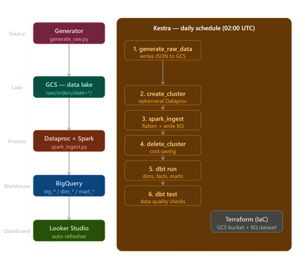
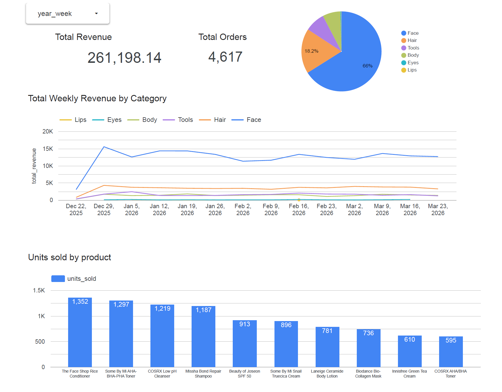
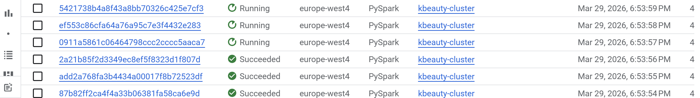
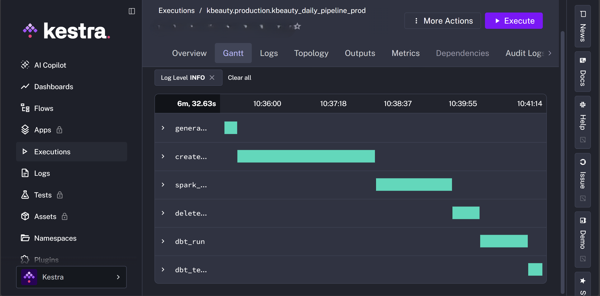

# K-Beauty Store End-to-End Data Pipeline

## Problem Description

The global K-beauty (Korean beauty) market is growing rapidly across Europe, 
with consumers increasingly purchasing skincare, haircare, and body products 
online. This project builds a production-grade end-to-end data pipeline for a 
simulated pan-European K-beauty e-commerce store.

The pipeline ingests daily sales data, processes it through a data lake and 
data warehouse, and surfaces actionable insights through an analytics dashboard. 
The goal is to answer two key business questions:

- **Which product categories generate the most revenue each week?**
- **Which products are the top sellers by units sold?**

The pipeline runs automatically every day, ensuring the dashboard always 
reflects the latest sales data.

## Dataset

The data is generated by a synthetic K-beauty store simulator (`generator/generate_raw.py`) 
that mimics a real e-commerce store API export. It produces realistic daily order data 
for a multi-brand retailer selling across 12 European countries (DACH, BeneLux, and beyond).

### Data characteristics
- **Source:** Synthetic generator simulating a Shopify-style store API
- **Format:** Raw nested JSON, one file per day, partitioned by date
- **Volume:** ~80 orders/day, ~180 line items/day, ~30,000 orders/year
- **History:** 91 days (December 28 2025 → March 29 2026)
- **Update frequency:** Daily (new file written to GCS every day)

### GCS raw zone layout
```
gs://kbeauty-data-lake-end2end/
├── raw/
│   ├── orders/
│   │   ├── date=2025-12-28/orders.json
│   │   ├── date=2025-12-29/orders.json
│   │   └── ...
│   └── products/
│       ├── snapshot_date=2025-12-28/products.json
│       └── ...
```

### Product catalogue
20 K-beauty products across 6 categories from 20 real brands:

| Category | Examples |
|---|---|
| Face | COSRX Snail Serum, Laneige Water Sleeping Mask, Beauty of Joseon SPF 50 |
| Hair | COSRX Scalp Shampoo, Laneige Damage Conditioner |
| Body | Laneige Ceramide Body Lotion, Innisfree Body Wash |
| Lips | Laneige Lip Sleeping Mask |
| Eyes | Medipeel Glutathione Eye Cream |
| Tools | Dr.Jart+ LED Mask, Skin1004 Facial Roller |

## Tech Stack

| Layer | Tool | Purpose |
|---|---|---|
| **Infrastructure as Code** | Terraform | Provisions GCS bucket and BigQuery dataset |
| **Cloud** | Google Cloud Platform (GCP) | Cloud provider |
| **Data Lake** | Google Cloud Storage (GCS) | Stores raw nested JSON partitioned by date |
| **Workflow Orchestration** | Kestra | Schedules and orchestrates the daily pipeline |
| **Batch Processing** | Apache Spark on Dataproc | Flattens nested JSON, writes to BigQuery |
| **Data Warehouse** | BigQuery | Stores staging, intermediate and mart tables |
| **Data Transformation** | dbt (data build tool) | Builds dims, facts and mart models |
| **Dashboard** | Looker Studio | Visualizes weekly revenue and top products |
| **Development Environment** | GitHub Codespaces | Cloud-based development and pipeline execution |
| **Containerization** | Docker / Docker Compose | Runs Kestra and its Postgres backend |
| **Language** | Python | Data generator and pipeline scripts |

## Architecture



### Daily pipeline flow

1. **Kestra** triggers at 02:00 UTC every day
2. **Generator** writes yesterday's raw nested JSON to GCS (`raw/orders/date=YYYY-MM-DD/`)
3. **Kestra** spins up an ephemeral Dataproc cluster
4. **Spark** reads raw JSON, flattens nested structure, writes partitioned tables to BigQuery
5. **Kestra** deletes the Dataproc cluster (cost saving)
6. **dbt** builds staging views, intermediate tables and mart tables in BigQuery
7. **Looker Studio** automatically picks up updated mart tables

### BigQuery layers

| Layer | Tables | Written by |
|---|---|---|
| Staging | `stg_orders`, `stg_order_items`, `stg_products` | Spark |
| Intermediate | `dim_products`, `dim_customers`, `fact_order_items` | dbt |
| Marts | `mart_weekly_revenue`, `mart_top_products` | dbt |

## Data Pipeline

This project uses a **batch processing** pipeline that runs daily.

### Ingestion — GCS (Data Lake)

The synthetic generator (`generator/generate_raw.py`) simulates a real K-beauty 
store API export. Each daily run produces two raw JSON files written to GCS:

- `gs://kbeauty-data-lake-end2end/raw/orders/date=YYYY-MM-DD/orders.json`
- `gs://kbeauty-data-lake-end2end/raw/products/snapshot_date=YYYY-MM-DD/products.json`

Raw orders arrive as **nested JSON** — each order contains a customer object and 
an items array. This mirrors how real e-commerce APIs (Shopify, WooCommerce) export data.

### Processing — Apache Spark on Dataproc

Spark's job is to handle the raw data's complexity before it reaches the warehouse:

- **Flatten** the nested JSON — explodes the `items` array into individual rows, 
  pulls customer fields up to the top level
- **Validate** — enforce types, drop nulls, deduplicate
- **Partition** — writes to BigQuery partitioned by `order_date` (DAY granularity)

Partitioning by day means BigQuery only scans the relevant date partitions when 
querying, reducing both cost and query time. Each daily Spark run only writes to 
its own partition without touching historical data.

Dataproc clusters are **ephemeral** — spun up by Kestra before the Spark job and 
deleted immediately after. This keeps infrastructure costs near zero.

### Transformation — dbt

dbt runs entirely inside BigQuery and builds three layers:

**Staging layer** (views) — light cleaning and deduplication of Spark output:
- `stg_orders` — one row per order, customer fields flattened
- `stg_order_items` — one row per line item, exploded from items array
- `stg_products` — latest product price snapshot

**Intermediate layer** (tables) — joins and business logic:
- `dim_products` — product dimension with margin calculations
- `dim_customers` — customer dimension derived from order history
- `fact_order_items` — core fact table, completed orders only

**Marts layer** (tables) — aggregations for the dashboard:
- `mart_weekly_revenue` — weekly revenue and units sold by category
- `mart_top_products` — top products ranked by units sold per week

### Orchestration — Kestra

The full pipeline is orchestrated by a Kestra flow 
(`kestra/flows/kbeauty_daily_pipeline_prod.yml`) that runs at **02:00 UTC daily**:
```
generate_raw_data
      ↓
create_dataproc_cluster
      ↓
spark_ingest
      ↓
delete_dataproc_cluster
      ↓
dbt_run
      ↓
dbt_test
```

Configuration values (GCS bucket, GCP project, region) are stored in 
Kestra's KV store — no credentials are hardcoded in the flow YAML.

## Dashboard
The dashboard is built in **Looker Studio** and connects directly to BigQuery mart tables.
It updates automatically when dbt refreshes the marts after each daily pipeline run.

**[View Dashboard](YOUR_LOOKER_STUDIO_LINK_HERE)**



### Tile 1 — Weekly Revenue by Category

A line chart showing total revenue per week broken down by product category 
(Face, Hair, Body, Lips, Eyes, Tools). Powered by `mart_weekly_revenue`.

### Tile 2 — Units Sold by Product

A bar chart showing the top 10 products by total units sold across the full period.
Powered by `mart_top_products`.

## How to Replicate this project
 
### Prerequisites
 
- Google Cloud Platform account with billing enabled
- GitHub Codespaces (or local Docker + Python environment)
- Terraform >= 1.7
 
### 1. Clone the repository
 
```bash
git clone https://github.com/ammu993/DE-ZoomcampFinalProject-Kbeautystore-pipeline.git
cd DE-ZoomcampFinalProject-Kbeautystore-pipeline
```
 
### 2. GCP setup
 
1. Create a new GCP project
2. Enable the following APIs:
   - Cloud Storage
   - BigQuery
   - Cloud Dataproc
   - Compute Engine
   - Identity and Access Management (IAM)
   - Cloud Resource Manager
3. Create a service account with these roles:
   - Storage Admin
   - BigQuery Admin
   - Dataproc Administrator
   - Service Account User
4. Download the service account key as JSON and save to `secrets/gcp-key.json`
 
### 3. Provision infrastructure with Terraform
 
```bash
cd terraform
cp terraform.tfvars.example terraform.tfvars
# edit terraform.tfvars with your project ID and bucket name
terraform init
terraform apply
cd ..
```
 
### 4. Configure environment
 
```bash
cp .env.example .env
# edit .env with your GCS bucket and GCP project values
export $(grep -v '^#' .env | xargs)
export GOOGLE_APPLICATION_CREDENTIALS=/path/to/secrets/gcp-key.json
```
 
### 5. Seed historical data
 
The following command generates 1 year of synthetic K-beauty order data and writes
it as raw nested JSON files to GCS, partitioned by date. It simulates what a real
store API would have produced over the past year — one `orders.json` file per day.
 
```bash
cd generator
pip install -r requirements.txt
GCS_BUCKET=your-bucket \
GCS_PROJECT=your-project \
GOOGLE_APPLICATION_CREDENTIALS=/path/to/secrets/gcp-key.json \
python generate_raw.py seed
cd ..
```
 
### 6. Upload Spark job to GCS
 
```bash
gsutil cp spark/spark_ingest.py gs://YOUR_BUCKET/jobs/
```
 
### 7. Run Spark to load BigQuery
 
Create a Dataproc cluster and submit the Spark job for your date range.
 
For example, to process 7 days (January 1-7 2026):
 
```bash
gcloud dataproc clusters create kbeauty-cluster \
  --region=europe-west4 \
  --master-machine-type=n1-standard-4 \
  --worker-machine-type=n1-standard-4 \
  --num-workers=2 \
  --image-version=2.1-debian11 \
  --project=YOUR_PROJECT_ID
 
for date in 2026-01-01 2026-01-02 2026-01-03 2026-01-04 2026-01-05 2026-01-06 2026-01-07; do
  gcloud dataproc jobs submit pyspark \
    gs://YOUR_BUCKET/jobs/spark_ingest.py \
    --cluster=kbeauty-cluster \
    --region=europe-west4 \
    --project=YOUR_PROJECT_ID \
    --jars=gs://spark-lib/bigquery/spark-bigquery-latest_2.12.jar \
    -- --date=$date
done
 
gcloud dataproc clusters delete kbeauty-cluster \
  --region=europe-west4 --quiet
```
 
To process a full 90-day range:
 
```bash
for date in $(seq 0 89 | xargs -I{} date -d "2025-12-28 + {} days" +%Y-%m-%d); do
  gcloud dataproc jobs submit pyspark \
    gs://YOUR_BUCKET/jobs/spark_ingest.py \
    --cluster=kbeauty-cluster \
    --region=europe-west4 \
    --project=YOUR_PROJECT_ID \
    --jars=gs://spark-lib/bigquery/spark-bigquery-latest_2.12.jar \
    --async \
    -- --date=$date
done
```

 
### 8. Run dbt transformations
 
Always export credentials before running dbt:
 
```bash
export GOOGLE_APPLICATION_CREDENTIALS=/path/to/secrets/gcp-key.json
 
cd dbt
pip install dbt-bigquery
dbt deps
dbt run
dbt test
cd ..
```
 
### 9. Set up Kestra for daily orchestration
 
```bash
docker compose up -d
```
 
Open Kestra UI at `http://localhost:8080`. You will be prompted to create an
admin account on first launch — use any username and password, for example:
 
```
Email:    admin@kbeauty.com
Password: admin123
```
 
Then:
 
1. Go to **Namespaces** → `kbeauty.production` → **KV Store**
2. Add the following KV pairs:
   - `GCS_BUCKET` — your GCS bucket name
   - `GCS_PROJECT` — your GCP project ID
   - `GCP_REGION` — your GCP region (e.g. `europe-west4`)
   - `BQ_DATASET` — `kbeauty_pipeline`
   - `GCP_CREDS` — paste the entire contents of your `secrets/gcp-key.json`
3. Import `kestra/flows/kbeauty_daily_pipeline_prod.yml`
4. The pipeline runs automatically at **02:00 UTC daily**
5. To trigger manually for a specific date, click **Execute** and enter the date
   in `YYYY-MM-DD` format (e.g. `2026-03-29`) in the `target_date` input field
> **Note:** The Kestra pipeline runs at 02:00 UTC and processes **yesterday's** data.
> If you start Kestra on March 30, it will ingest March 29's orders. To process a 
> specific date, execute the flow manually from the Kestra UI and enter the date 
> in `YYYY-MM-DD` format in the `target_date` input field.
   


### 10. Connect Looker Studio
 
1. Go to [lookerstudio.google.com](https://lookerstudio.google.com)
2. Create a new report → Add data → BigQuery
3. Select your project → dataset `kbeauty_pipeline_marts`
4. Add `mart_weekly_revenue` and `mart_top_products` as data sources
5. Build your charts — the dashboard refreshes automatically after each pipeline run
